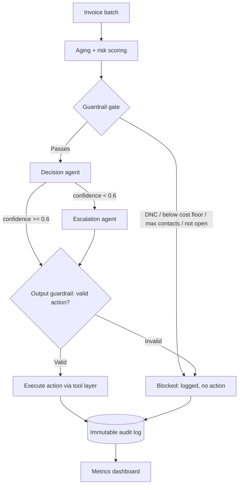

# Project brief: AI Revenue Recovery Agent — B2B Receivables Chaser + Promise-to-Pay Tracker

Feed this whole file to your coding LLM (Claude Code, Cursor, etc.) as the first message. It contains
everything needed to scaffold, build, and run the MVP end to end. Build in the order of the phases in
section 8 — do not skip ahead to the dashboard before the core pipeline works on the CLI/API level.

---

## 1. One-line pitch

An agent that triages a batch of overdue B2B invoices, decides the right recovery action under
compliance guardrails, tracks customer payment promises, and auto-escalates broken promises — with
every decision logged in an immutable audit trail and a measured recovery rate at the end.

Built for: Razorpay AI Buildathon 2026, Track 03 — AI Revenue Recovery.

## 2. Non-negotiable requirements (this is what gets scored)

- Every money-adjacent action must be **explainable** (has a stored reasoning string), **bounded**
  (only one of a fixed set of actions is ever executed), and **gated** (passes guardrails before and
  after the model call).
- Report **measured outcomes on a batch** — percentage of at-risk amount recovered, not just "it ran."
- Show **compliant escalation**: a do-not-contact flag must always block contact, no exceptions.
- Show **stopping rules**: max contact attempts, auto-stop on payment/dispute.
- Show a **full audit trail**, exportable as CSV.
- In the README, include a section titled "What broke and how we fixed it" — this is read closely by
  judges, so keep at least one real entry, don't fabricate a trivial one.

## 3. Tech stack (optimized for speed, not for scale — this is an MVP)

- **Backend:** Node.js + Express (or FastAPI if you're faster in Python — either is fine, pick one and
  don't mix)
- **Database:** SQLite via better-sqlite3 (Node) or sqlite3 (Python) — zero setup, file-based, good
  enough for a demo. Do NOT reach for Postgres/Mongo for the MVP.
- **LLM provider:** Groq API (free tier, very fast) for the light model calls. Use an Anthropic or
  OpenAI key instead if you already have one set up — the prompts below are model-agnostic.
- **Frontend:** React + Vite + Tailwind (a single dashboard page is enough — do not build multiple
  routes/pages)
- **No auth, no deployment infra needed** — this runs locally for the demo. Do not spend time on
  Vercel/Render deployment unless you finish everything else with time to spare.

## 4. Repo structure to scaffold

```
ai-revenue-recovery/
├── README.md                      # see section 9 for required sections
├── server/
│   ├── index.js                   # Express app entrypoint
│   ├── db.js                      # SQLite connection + schema migration
│   ├── data/
│   │   └── mock_invoices.csv      # synthetic dataset, see section 5
│   ├── engine/
│   │   ├── aging.js               # deterministic aging + risk score (no AI)
│   │   ├── guardrails.js          # deterministic input + output guardrails
│   │   ├── decisionAgent.js       # calls light LLM, returns validated JSON
│   │   ├── escalationAgent.js     # calls heavier LLM, only on flagged cases
│   │   ├── promiseTracker.js      # parses + tracks promise-to-pay commitments
│   │   └── orchestrator.js        # per-invoice state machine, ties it together
│   ├── routes/
│   │   ├── invoices.js            # POST /api/invoices/bulk, GET /api/invoices
│   │   ├── recover.js             # POST /api/recover  (runs the batch)
│   │   ├── promises.js            # POST /api/promises  (simulate a customer reply)
│   │   ├── metrics.js             # GET /api/metrics
│   │   └── audit.js               # GET /api/audit, GET /api/audit/export
│   └── seed/
│       └── reset.js                # POST /api/seed/reset — wipes DB for demo
├── client/
│   ├── src/
│   │   ├── App.jsx
│   │   ├── components/
│   │   │   ├── InvoiceTable.jsx
│   │   │   ├── MetricsCards.jsx
│   │   │   ├── AuditTrail.jsx
│   │   │   └── PromiseSimulator.jsx   # text box to simulate a customer reply
│   │   └── main.jsx
│   └── index.html
└── .env.example
```

## 5. Data model

### 5.1 `invoices` table

| column | type | notes |
|---|---|---|
| id | text (pk) | e.g. `INV-0001` |
| customer_id | text | |
| customer_name | text | |
| amount | integer | in paise/cents to avoid float issues |
| due_date | date | |
| days_overdue | integer | computed at import or refresh |
| past_default_count | integer | 0–5, synthetic |
| dnc_flag | boolean | do-not-contact |
| status | text | `open \| paid \| disputed \| written_off` |
| contact_count | integer | default 0 |
| risk_score | real | computed by aging.js |
| bucket | text | `0-30 \| 31-60 \| 60+` |

### 5.2 `promises` table

| column | type | notes |
|---|---|---|
| id | integer (pk, autoincrement) | |
| invoice_id | text (fk) | |
| raw_text | text | the customer's reply as typed |
| promised_date | date | parsed by parse_promise_date |
| confidence | real | 0–1 |
| status | text | `pending \| kept \| broken` |

### 5.3 `audit_log` table (append-only — never UPDATE or DELETE from this table)

| column | type | notes |
|---|---|---|
| id | integer (pk, autoincrement) | |
| invoice_id | text | |
| actor | text | `system \| decision_agent \| escalation_agent \| guardrail` |
| action | text | the action taken, or `blocked:<reason>` if rejected |
| reasoning | text | model's reasoning string, or a fixed string for deterministic steps |
| timestamp | datetime | default now |

### 5.4 Synthetic dataset — `mock_invoices.csv`

Generate ~100 rows with this rough distribution so the demo has variety:
- 60% normal overdue invoices, 0–90 days overdue, amounts ₹2,000–₹500,000
- 10% with `dnc_flag = true` (to prove the guardrail works)
- 10% with `amount` below ₹500 (to prove the cost-floor guardrail works)
- 10% with `past_default_count >= 3` (high risk, should escalate)
- 10% deliberately weird edge cases: one already `disputed`, one with `contact_count` already at the max
  cap, one with an unusually large amount (₹2,000,000+) that should always route to a human regardless
  of what the model says

## 6. Deterministic logic (no LLM — write this as plain functions, unit-testable)

### 6.1 `aging.js`
```
bucket = days_overdue <= 30 ? "0-30" : days_overdue <= 60 ? "31-60" : "60+"
risk_score = (amount / 1000) * (1 + days_overdue / 30) * (1 + past_default_count * 0.5)
```

### 6.2 `guardrails.js` — INPUT guardrail (runs before any model call)
Block (skip, log as `blocked:dnc`) if `dnc_flag == true`.
Block (skip, log as `blocked:below_cost_floor`) if `amount < 50000` (₹500 in paise).
Block (skip, log as `blocked:max_contacts`) if `contact_count >= 4`.
Block (skip, log as `blocked:already_resolved`) if `status != "open"`.
Anything not blocked passes through to the decision agent.

### 6.3 `guardrails.js` — OUTPUT guardrail (runs after the model responds, before any tool executes)
The decision agent's raw output MUST be validated against this exact schema before anything else
touches it:
```json
{
  "action": "gentle_reminder | firm_followup | escalate_to_manager | legal_notice_draft",
  "confidence": "number between 0 and 1",
  "reasoning": "string, max 300 chars",
  "message_draft": "string"
}
```
If `action` is not one of the four allowed values → reject, log as `blocked:invalid_action`, do not
execute anything. If `confidence < 0.6` → do not execute the action directly; instead route to the
escalation agent for a second opinion. This low-confidence routing rule is your main "AI judgment"
talking point — make sure it actually fires at least once during the demo (seed data should include a
case that triggers it).

## 7. LLM prompts (use these verbatim as your starting system prompts)

### 7.1 Decision agent (light model) — system prompt
```
You are a compliance-bound B2B receivables recovery agent. You will be given one overdue invoice's
data (amount, days overdue, risk score, bucket, past default count, prior contact count). You must
decide exactly one recovery action from this fixed set — never invent a new action:

- gentle_reminder: for early-stage, low-risk invoices
- firm_followup: for invoices that have already had a gentle reminder or moderate risk
- escalate_to_manager: for high risk, high value, or repeat defaulters
- legal_notice_draft: only for severe cases — very high risk AND very overdue AND high value

Respond with ONLY valid JSON, no other text, in this exact shape:
{"action": "...", "confidence": 0.0-1.0, "reasoning": "...", "message_draft": "..."}

The reasoning field must reference the specific numbers you were given (amount, days overdue, risk
score) — do not give a generic justification.
```

### 7.2 Escalation agent (heavier model) — system prompt
```
You are a senior recovery specialist reviewing a case that a junior agent flagged as low-confidence or
ambiguous. You will be given the invoice data AND the junior agent's proposed action and reasoning.
Decide whether to confirm the junior agent's action, override it with a different action from the same
fixed set (gentle_reminder, firm_followup, escalate_to_manager, legal_notice_draft), or escalate to a
human. Be conservative: when genuinely uncertain, prefer escalating to a human over guessing.

Respond with ONLY valid JSON:
{"decision": "confirm | override | escalate_to_human", "action": "...", "reasoning": "..."}
```

### 7.3 Promise-date extraction (light model, JSON mode) — system prompt
```
Extract a payment promise date from the customer's message below. Today's date is {today}. Respond
with ONLY valid JSON: {"date": "YYYY-MM-DD or null", "confidence": 0.0-1.0}. If no clear date is
promised, return null for date and confidence 0.
```

## 8. Build order (follow this sequence — do not jump to the dashboard first)

1. **Scaffold + data** — Express app boots, SQLite schema created, `mock_invoices.csv` generated and
   importable via `POST /api/invoices/bulk`.
2. **Deterministic core** — `aging.js` + `guardrails.js` (input side) fully unit-tested with plain
   Node/Jest tests before touching any LLM code. Verify: DNC invoices never reach the next step, low
   amounts never reach the next step.
3. **Decision agent** — wire up the LLM call, output guardrail validation, and `log_audit` on every
   single outcome (executed, blocked, or low-confidence-routed). Test with `POST /api/recover` on a
   small batch first (5–10 invoices), read the raw audit log rows to sanity check before scaling up.
4. **Escalation agent + promise tracker** — wire the low-confidence routing path, then build
   `POST /api/promises` to simulate a customer reply, `parse_promise_date`, and the auto-escalation
   when a promise's `promised_date` passes with `status` still `pending`.
5. **Dashboard** — `GET /api/metrics` (amount at risk, amount recovered/simulated, recovery rate %,
   escalation count, broken-promise rate) and `GET /api/audit` + `/api/audit/export` (CSV download).
   Build the React dashboard against these two endpoints plus `GET /api/invoices`.
6. **Edge cases + demo rehearsal** — walk through the exact demo script in section 10 end to end at
   least twice before recording the pitch video.

## 9. Required README sections (match the buildathon's evaluation criteria directly)

1. Problem (2–3 sentences, use section 2 of the project design doc)
2. Architecture diagram (paste the Mermaid version below or a screenshot of your own)
3. How the AI thinks (the JSON decision contract + one worked example, real or realistic)
4. API reference (table of routes)
5. Getting started (exact setup commands)
6. Demo walkthrough guide (numbered steps, see section 10)
7. **What broke and how we fixed it** — do not skip or fake this section
8. Future roadmap (webhooks instead of batch, real Postgres, customer portal, multi-agent
   cross-verification for high-value cases)

Mermaid architecture diagram to paste into the README:


## 10. Demo walkthrough (rehearse this exact sequence)

1. Hit `POST /api/seed/reset` to wipe the DB clean on camera.
2. Import `mock_invoices.csv` via the dashboard's import button.
3. Run `POST /api/recover` and watch the batch process in the UI.
4. Open the Audit Trail tab — point out one blocked-DNC case and one low-confidence case that got
   routed to the escalation agent, reading the reasoning field out loud.
5. Use the Promise Simulator to type a reply for one invoice (e.g. "will pay by the 20th"), show it
   logged in the promises table.
6. Manually advance the simulated date past the promised date (add a `POST /api/promises/:id/expire`
   dev-only route for this) and show the auto-escalation firing.
7. Show the Metrics tab: recovery rate %, amount at risk vs recovered, broken-promise rate.
8. Export the audit CSV and open it to show the raw log.

## 11. Explicit non-goals for the MVP (state these in the README, don't build them)

- No real email/SMS sending — log what would have been sent, or use a sandboxed provider
- No production auth/rate limiting
- No webhook-triggered real-time processing — batch only, triggered manually
- No multi-tenant support — single merchant context is fine

## 12. .env.example

```
PORT=5000
GROQ_API_KEY=your_key_here
# or ANTHROPIC_API_KEY=your_key_here
DECISION_MODEL=llama-3.1-8b-instant
ESCALATION_MODEL=llama-3.1-70b-versatile
```

---

When you (the coding LLM) start: build section 8 in order, write tests for section 6 before wiring any
LLM calls, and stop after each phase to report what was built and what — if anything — broke, so that
becomes real content for the README's "what broke" section rather than something invented afterward.
