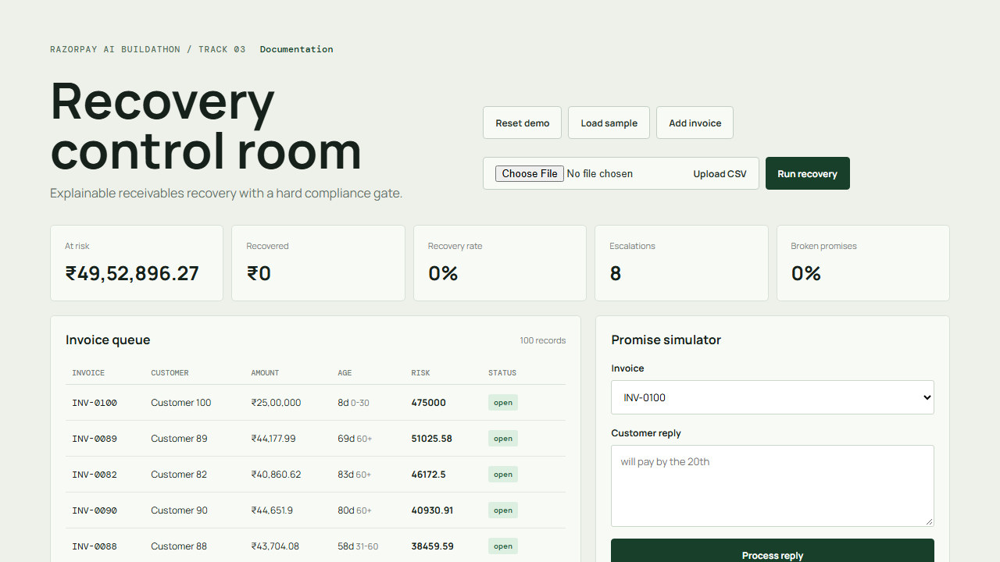
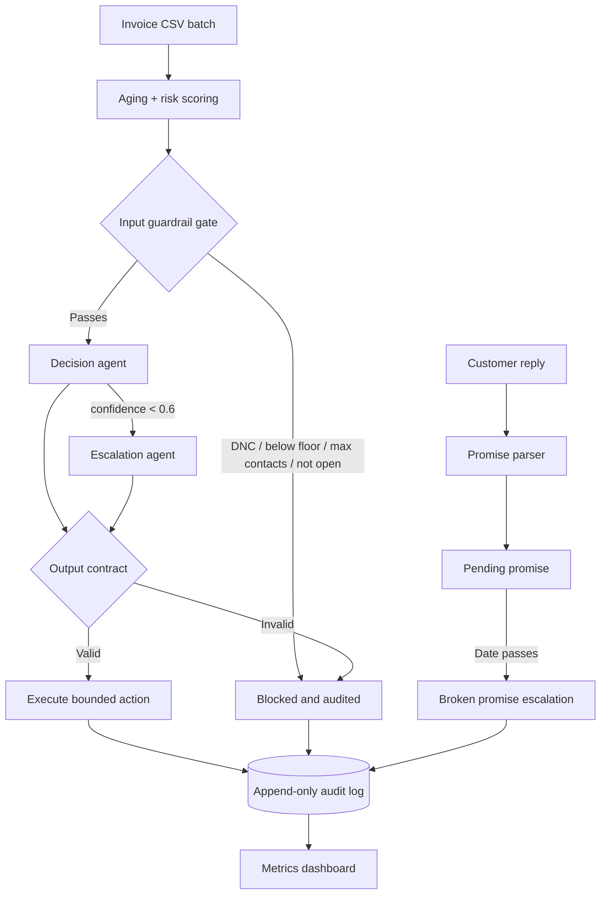

# AI Revenue Recovery Agent

> **Explainable B2B receivables recovery with compliance gates, promise tracking, and an immutable audit trail.**

[](https://nodejs.org/)
[](https://vite.dev/)
[](https://www.sqlite.org/)
[](https://groq.com/)
[](https://www.docker.com/)

## Product Overview

Revenue teams need to follow up overdue B2B invoices without violating customer preferences, wasting effort on tiny balances, or continuing after payment and disputes. This MVP turns that workflow into a bounded, explainable state machine: deterministic policy decides whether an invoice may be considered, AI selects one allowed recovery action, and every outcome is written to an append-only audit log.

This is built for the **Razorpay AI Buildathon 2026, Track 03: AI Revenue Recovery**.

### What the MVP demonstrates

- Batch triage of 100 synthetic overdue invoices
- Aging bucket and risk-score calculation without AI
- DNC, cost-floor, max-contact, and resolved-status blocking
- Strict JSON output validation for model decisions
- Low-confidence routing to a second, heavier model
- Promise-to-pay date extraction and broken-promise escalation
- Recovery, escalation, and broken-promise metrics
- CSV-exportable audit history
- Local Docker demo with a single UI/API port

## Screenshots

### Recovery control room

The dashboard shows the invoice queue, business metrics, promise simulator, and recent audit decisions in one view.



> To refresh the screenshot after changing the UI, run the app, open `http://localhost:5000`, import the sample data, and capture the page at desktop width.

## Architecture



## User Flow

1. **Reset:** clear the SQLite demo state.
2. **Import:** click **Load sample** for the built-in dataset or **Upload CSV** to choose your own compatible CSV.
3. **Score:** calculate each invoice's bucket and risk score.
4. **Gate:** stop DNC, low-value, max-contact, paid, disputed, and written-off records.
5. **Decide:** ask the decision model for exactly one allowed action.
6. **Review:** send confidence below `0.6` to the escalation model.
7. **Execute:** increment contact count and log the proposed action. No real email or SMS is sent.
8. **Track:** enter a reply such as `will pay by the 20th` in Promise Simulator.
9. **Escalate:** expire a promise using the demo route to create a broken-promise audit event.
10. **Measure:** inspect recovery metrics and download the audit CSV.

## Guardrails and Deterministic Rules

### Aging

```text
bucket = days_overdue <= 30 ? "0-30"
       : days_overdue <= 60 ? "31-60"
       : "60+"

risk_score = (amount / 1000)
           * (1 + days_overdue / 30)
           * (1 + past_default_count * 0.5)
```

### Input gate

The model is never called when any of these is true:

| Condition | Audit action |
|---|---|
| `dnc_flag = true` | `blocked:dnc` |
| `amount < 50000` paise | `blocked:below_cost_floor` |
| `contact_count >= 4` | `blocked:max_contacts` |
| `status != open` | `blocked:already_resolved` |

### Allowed model actions

The decision agent can return only:

`gentle_reminder` · `firm_followup` · `escalate_to_manager` · `legal_notice_draft`

Invalid actions are blocked. Confidence below `0.6` is routed to the escalation agent before any action is executed.

## AI Model Configuration

Copy `.env.example` to `.env` and provide your Groq key:

```env
PORT=5000
GROQ_API_KEY=your_key_here
DECISION_MODEL=llama-3.1-8b-instant
ESCALATION_MODEL=llama-3.1-70b-versatile
PROMISE_MODEL=llama-3.1-8b-instant
```

| Model setting | Code location | Responsibility |
|---|---|---|
| `DECISION_MODEL` | `server/engine/decisionAgent.js` | Select bounded invoice action |
| `ESCALATION_MODEL` | `server/engine/escalationAgent.js` | Review low-confidence decisions |
| `PROMISE_MODEL` | `server/engine/promiseTracker.js` | Extract promised payment date |

When `GROQ_API_KEY` is missing, the app uses deterministic mock responses so the complete UI demo still works offline. The model prompts are stored next to the code that calls them.

## Data Model

### `invoices`

Stores `id`, customer identity, amount in paise, due date, days overdue, past default count, DNC flag, status, contact count, risk score, and aging bucket.

### `promises`

Stores the invoice, raw customer reply, parsed promised date, parser confidence, and `pending`, `kept`, or `broken` status.

### `audit_log`

Stores invoice, actor, action, reasoning, and timestamp. Application code only inserts audit rows; it never updates or deletes them.

## Synthetic Dataset

`server/data/mock_invoices.csv` contains 100 generated records:

- Normal overdue invoices with varied amounts and aging
- 10 DNC cases
- 10 invoices below the ₹500 cost floor
- 10 repeat defaulters with `past_default_count >= 3`
- A disputed invoice
- An invoice already at the four-contact cap
- A ₹2,000,000+ high-value invoice
- `INV-0007`, which deliberately triggers low-confidence routing

Regenerate it with:

```powershell
npm run generate:data
```

## API Reference

Base URL: `http://localhost:5000`

| Method | Endpoint | Description |
|---|---|---|
| `POST` | `/api/seed/reset` | Clear invoices, promises, and audit rows |
| `GET` | `/api/invoices` | Return invoice queue |
| `POST` | `/api/invoices/:id/mark-paid` | Demo-only mark an open invoice paid and remove it from the at-risk pool |
| `GET` | `/api/invoices/sample` | Return generated CSV |
| `POST` | `/api/invoices/bulk` | Import CSV text or JSON invoice rows |
| `POST` | `/api/recover` | Process the batch; optional body `{ "limit": 10 }` |
| `POST` | `/api/promises` | Parse and store a customer reply |
| `GET` | `/api/promises` | List recorded promises |
| `POST` | `/api/promises/:id/expire` | Demo-only simulated expiry |
| `GET` | `/api/metrics` | Return risk, recovery, escalation, and promise metrics |
| `GET` | `/api/audit` | Return recent audit rows |
| `GET` | `/api/audit/export` | Download audit history as CSV |
| `GET` | `/api/health` | Confirm the API function and storage mode are running |

### Example API session

```powershell
# Reset
Invoke-RestMethod -Method Post http://localhost:5000/api/seed/reset

# Import generated data
$csv = Invoke-WebRequest http://localhost:5000/api/invoices/sample -UseBasicParsing
Invoke-RestMethod -Method Post `
  -Uri http://localhost:5000/api/invoices/bulk `
  -ContentType 'text/csv' -Body $csv.Content

# Run a small test batch
Invoke-RestMethod -Method Post `
  -Uri http://localhost:5000/api/recover `
  -ContentType 'application/json' -Body '{"limit":10}'

# Record a promise
Invoke-RestMethod -Method Post `
  -Uri http://localhost:5000/api/promises `
  -ContentType 'application/json' `
  -Body '{"invoice_id":"INV-0001","raw_text":"will pay by the 20th"}'
```

## Getting Started

### Option A: Docker

Prerequisite: Docker Desktop with the Linux engine running.

```powershell
Copy-Item .env.example .env
docker compose up --build
```

Open `http://localhost:5000`. The built React dashboard and Express API share the same port.

### Option B: Local Node.js

Prerequisite: Node.js 20 or newer.

```powershell
npm install
npm run generate:data
Copy-Item .env.example .env
npm start
```

For frontend development with hot reload:

```powershell
cd client
npm install
npm run dev
```

The development dashboard runs at `http://localhost:5173` and proxies API calls to port 5000.

### Option C: One-project Vercel deployment

This repository includes `vercel.json` and `api/index.js`, so Vercel can deploy the React dashboard and Express API from one GitHub repository.

1. Push the latest `main` branch to GitHub.
2. Open [Vercel](https://vercel.com/new) and select **Add New Project**.
3. Import `IshaanAggrawal/Razorpay_buildathon`.
4. Keep the framework preset as **Other**. Vercel will use the repository's `vercel.json`.
5. Add these environment variables in **Settings > Environment Variables**:

  ```text
  GROQ_API_KEY=your_rotated_groq_key
  DECISION_MODEL=llama-3.1-8b-instant
  ESCALATION_MODEL=llama-3.1-70b-versatile
  PROMISE_MODEL=llama-3.1-8b-instant
  PORT=5000
  ```

6. Click **Deploy**, then open the generated Vercel URL.

The dashboard calls `/api/...` on the same Vercel domain, so no frontend API URL needs to be edited. Use **Load sample**, then **Run recovery** to verify the deployment.

#### Vercel limitation for this MVP

Vercel functions do not provide durable local disk storage. The SQLite file may reset between deployments or function instances, so this deployment is suitable for a visual/demo preview, not persistent production data. For a reliable hosted demo, keep the same API contract but replace `better-sqlite3` with a hosted SQLite-compatible database such as Turso, or use the included Docker deployment locally. Never commit `.env` or a real API key.

## Demo Script

1. Click **Reset demo**.
2. Click **Load sample**, or use **Upload CSV** with a file containing `id`, `customer_id`, `customer_name`, `amount`, `due_date`, and `days_overdue` columns.
3. Click **Run recovery**.
4. Click **Mark paid** on 2–3 open invoices to show the recovery rate move off 0%.
5. Point to a `blocked:dnc` audit row and explain that no model call or contact occurs.
6. Point to `INV-0007` and explain the `0.42` confidence route to the escalation agent.
7. Enter `will pay by the 20th` in Promise Simulator.
8. Use `POST /api/promises/:id/expire` with a later date to demonstrate broken-promise escalation.
9. Show amount at risk, recovery rate, escalation count, and broken-promise rate.
10. Click **Export CSV** and open the raw audit trail.

## Tests

The deterministic core is tested before model behavior:

```powershell
npm test
```

The suite verifies bucket boundaries, the risk formula, DNC blocking, cost-floor blocking, max-contact blocking, resolved-status blocking, allowed actions, invalid actions, reasoning length, and low-confidence routing.

## What Broke and How We Fixed It

During the first deterministic test pass, the expected risk score was written as `300` for a case whose aging and repeat-default multipliers actually produce `400`. The failing test exposed the mismatch before any API or model code existed. The assertion was corrected to the specified formula, preserving the deterministic core as an independently testable control layer.

The first end-to-end batch also exposed a functional gap: metrics already calculated `amountRecovered` and `recoveryRate` from invoices with `status = 'paid'`, but no route or UI action could ever move an open invoice into that state. Recovery was therefore permanently reported as 0%. We added the demo-only `POST /api/invoices/:id/mark-paid` flow, audit logging, a per-row **Mark paid** button, and a regression test proving that paid amounts and recovery rate update while disputed or already-paid invoices are rejected.

## Tech Stack

**Backend:** Node.js, Express, better-sqlite3, native `fetch`

**Frontend:** React, Vite, responsive CSS

**AI:** Groq OpenAI-compatible chat completions with JSON response mode

**Data:** SQLite, generated CSV fixtures, append-only audit records

**Operations:** Docker, Docker Compose, `.env` configuration

## Roadmap

- Replace manual batches with invoice webhooks
- Add a customer payment portal
- Move SQLite to Postgres for production scale
- Add multi-agent cross-verification for high-value invoices
- Add real email/SMS sandbox integrations with approval gates

## Non-goals

This MVP does not send real email or SMS, provide production authentication or rate limiting, process webhook events in real time, support multiple tenants, or include deployment infrastructure.
